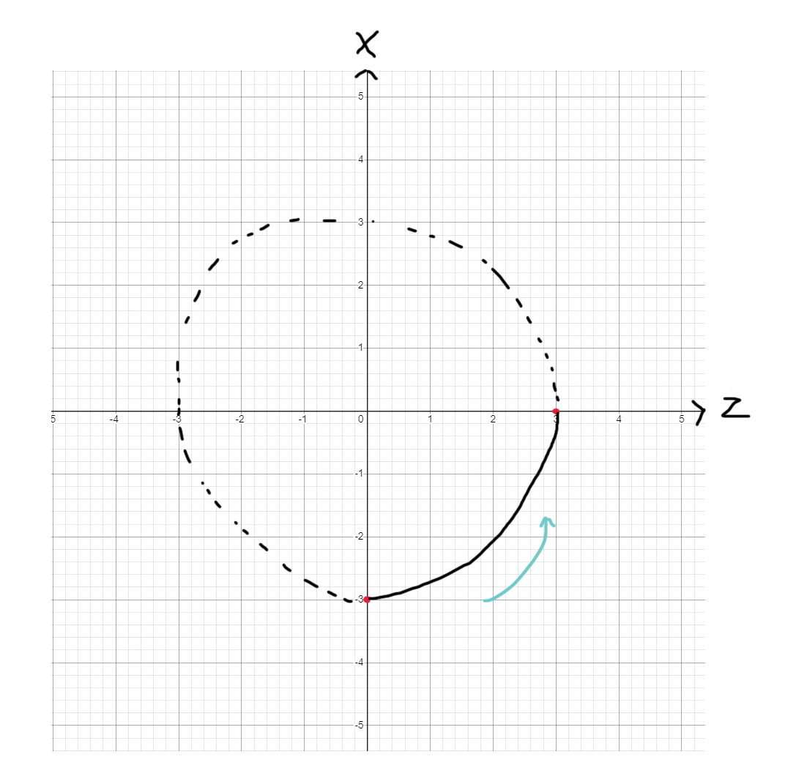

# Tutorial 2 (Advanced)

This tutorial will show you how to create this particle step by step:



It is recommended to copy the code for every step and see how it looks in-game.

First, we create a basic circle animation. We are using a group circle envelope wrapper, that creates a circle between 2 points in the XZ plane (no Y component).\
This will create the necessary envelopes to draw a circle centered on (0,0) with a radius of 3, which will be drawn fully within 100 ticks, then repeat.




```kotlin
partigonParticle(Location(Bukkit.getWorld("world"), 0.0, 100.0, 0.0), Particle.END_ROD) {
    envelopes = circleEnvelopeGroup( // Create circle group
        EnvelopeGroup.EnvelopeGroupType.POSITION, // We are animating the position properties
        EnvelopePair((-3.0).envelope, 0.0.envelope), // (X,Z) = (-3, 0)
        EnvelopePair(0.0.envelope, (3.0).envelope), // (X,Z) = (0, 3)
        CircleEnvelopeWrapper.CircleDirection.RIGHT, // Circle will be drawn to the right of the line connecting the two points
        RepeatLoop(100) // Animation will last 100 frames, then repeat
    ).getEnvelopes() // Get the envelopes from the group
}.start()
```


_Try it in game, see if it works!_

The magic of this effect is giving the particles velocity towards the center of the circle. To do that, we need to set the particle count to 0. The extra value will control the speed of the particles, and offset will control the direction.

To move the particles towards the center, their offset should be calculated as follows:\
(pos2) - (pos1) = (0, 0) - (X, Z) = - (X, Z)\
In simpler terms, it should be the inverse of their position.\
So we just create another circle group for the offset, and invert the values.

Because we are using multiple envelope groups, I suggest making a list, and using the spread operator to fill it with the envelopes from the groups.


```kotlin
partigonParticle(Location(Bukkit.getWorld("world"), 0.0, 100.0, 0.0), Particle.END_ROD) {
    envelopes = listOf(
        *circleEnvelopeGroup( // We use spread operator
            EnvelopeGroup.EnvelopeGroupType.POSITION,
            EnvelopePair((-3.0).envelope, 0.0.envelope), // (X,Z) = (-3, 0)
            EnvelopePair(0.0.envelope, (3.0).envelope), // (X,Z) = (0, 3)
            CircleEnvelopeWrapper.CircleDirection.RIGHT,
            RepeatLoop(100),
        ).getEnvelopes().toTypedArray(),

        *circleEnvelopeGroup(
            EnvelopeGroup.EnvelopeGroupType.OFFSET,
            EnvelopePair((3.0).envelope, 0.0.envelope), // (X,Z) = (3, 0). Inverse of (-3, 0)
            EnvelopePair(0.0.envelope, (-3.0).envelope), // (X,Z) = (0, -3). Inverse of (0, 3)
            CircleEnvelopeWrapper.CircleDirection.RIGHT,
            RepeatLoop(100),
        ).getEnvelopes().toTypedArray(),
    )
    
    extra = 0.05.envelope
    count = 0.envelope
}.start()
```


To make it go up and down, we use a simple curve envelope wrapper with a bounce loop:


```kotlin
partigonParticle(Location(Bukkit.getWorld("world"), 0.0, 100.0, 0.0), Particle.END_ROD) {
    envelopes = listOf(
        *circleEnvelopeGroup( // We use spread operator
            EnvelopeGroup.EnvelopeGroupType.POSITION,
            EnvelopePair((-3.0).envelope, 0.0.envelope),
            EnvelopePair(0.0.envelope, (3.0).envelope),
            CircleEnvelopeWrapper.CircleDirection.RIGHT,
            RepeatLoop(100),
        ).getEnvelopes().toTypedArray(),

        *circleEnvelopeGroup(
            EnvelopeGroup.EnvelopeGroupType.OFFSET,
            EnvelopePair((3.0).envelope, 0.0.envelope),
            EnvelopePair(0.0.envelope, (-3.0).envelope),
            CircleEnvelopeWrapper.CircleDirection.RIGHT,
            RepeatLoop(100),
        ).getEnvelopes().toTypedArray(),

        curveEnvelope(
            Envelope.PropertyType.POS_Y,
            0.0.envelope, 4.0.envelope, // Because completion is 1.0 by default, it'll go from 0.0 -> 4.0, then from 4.0 -> 8.0. Can set to 0.5, but it'll be less smooth, better to take advantage of the sin/cos functions.
            CurveEnvelopeWrapper.CurveOrientation.BELOW, // Can alternatively use ABOVE, will result in a slightly different effect.
            BounceLoop(200) // Will go from 0.0 to 8.0 in 100 ticks, then go back to 0.0 in 100 ticks. Then repeat.
        )
    )

    extra = 0.05.envelope
    count = 0.envelope
}.start()
```


Now, in order to create 6 of these particles, we could create 6 particles with the same exact envelopes and properties and mirror them, but that'd be a lot of boilerplate code.

Instead, we'll represent our particle properties with a builder, and create a top level function to return it (particles and envelopes are mutable, so we cannot just pass them around and change them without affecting all particles that use them).


```kotlin
// Define basic animation
fun builder() =
    partigonParticleBuilder(Location(Bukkit.getWorld("world"), 0.0, 100.0, 0.0), Particle.END_ROD) {
        envelopes = listOf(
            *circleEnvelopeGroup(
                EnvelopeGroup.EnvelopeGroupType.POSITION,
                EnvelopePair((-3.0).envelope, 0.0.envelope),
                EnvelopePair(0.0.envelope, (3.0).envelope),
                CircleEnvelopeWrapper.CircleDirection.RIGHT,
                RepeatLoop(100),
            ).getEnvelopes().toTypedArray(),

            *circleEnvelopeGroup(
                EnvelopeGroup.EnvelopeGroupType.OFFSET,
                EnvelopePair((3.0).envelope, 0.0.envelope),
                EnvelopePair(0.0.envelope, (-3.0).envelope),
                CircleEnvelopeWrapper.CircleDirection.RIGHT,
                RepeatLoop(100),
            ).getEnvelopes().toTypedArray(),

            curveEnvelope(
                Envelope.PropertyType.POS_Y,
                0.0.envelope, 4.0.envelope,
                CurveEnvelopeWrapper.CurveOrientation.BELOW,
                BounceLoop(200),
            )
        )
        extra = 0.05.envelope
        count = 0.envelope
    }
```


To create 6 symmetric particles, we use our builder() function and mirror all the particles around (0,0) in different axes:

```kotlin
val particle1 = builder().build().start()
// Mirror all particles:
val particle2 = builder().apply {
    this.rotationOptions = listOf(
        RotationOptions(EnvelopeTriple(0.0.envelope, 0.0.envelope, 0.0.envelope), 
            180.0.envelope, RotationType.X_AXIS),
    )
}.build().start()
val particle3 = builder().apply {
    this.rotationOptions = listOf(
        RotationOptions(EnvelopeTriple(0.0.envelope, 0.0.envelope, 0.0.envelope), 
            180.0.envelope, RotationType.Z_AXIS)
    )
}.build().start()
val particle4 = builder().apply {
    this.rotationOptions = listOf(
        RotationOptions(EnvelopeTriple(0.0.envelope, 0.0.envelope, 0.0.envelope), 
            180.0.envelope, RotationType.X_AXIS),
        RotationOptions(EnvelopeTriple(0.0.envelope, 0.0.envelope, 0.0.envelope), 
            180.0.envelope, RotationType.Z_AXIS)
    )
}.build().start()
val particle5 = builder().apply {
    this.rotationOptions = listOf(
        RotationOptions(EnvelopeTriple(0.0.envelope, 0.0.envelope, 0.0.envelope), 
            270.0.envelope, RotationType.Y_AXIS),
        RotationOptions(EnvelopeTriple(0.0.envelope, 0.0.envelope, 0.0.envelope), 
            180.0.envelope, RotationType.Z_AXIS)
    )
}.build().start()
val particle6 = builder().apply {
    this.rotationOptions = listOf(
        RotationOptions(EnvelopeTriple(0.0.envelope, 0.0.envelope, 0.0.envelope), 
            270.0.envelope, RotationType.Y_AXIS),
        RotationOptions(EnvelopeTriple(0.0.envelope, 0.0.envelope, 0.0.envelope), 
            180.0.envelope, RotationType.X_AXIS)
    )
}.build().start()
```

And that's it! Play around with the numbers, change some properties and you'll see how easy it is to create a completely different and unique animation :)
